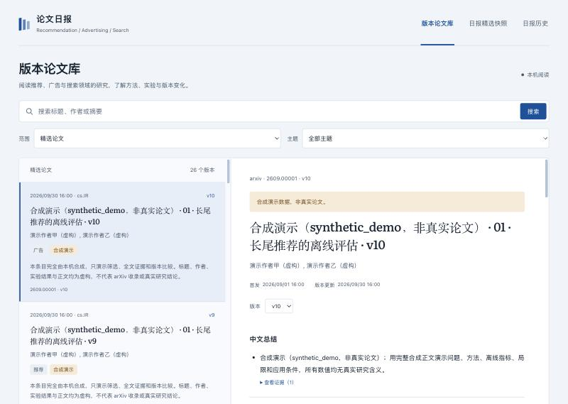
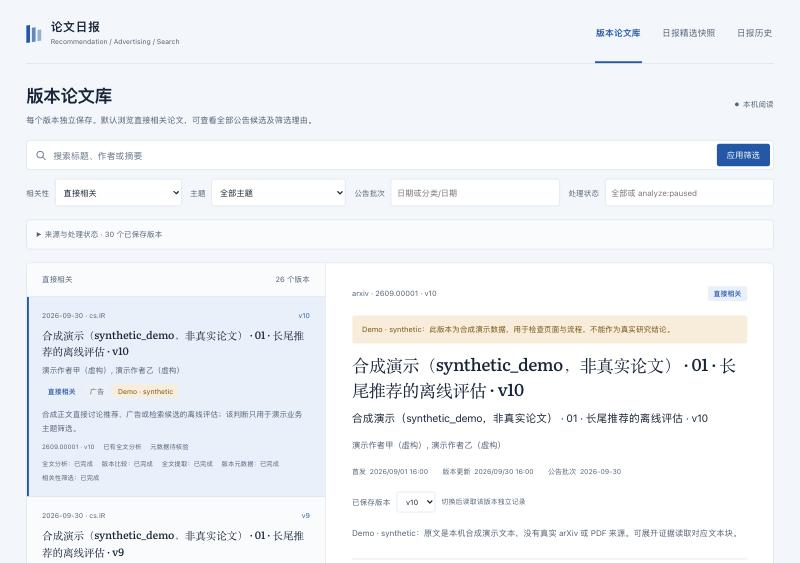

# 论文库流水线实施验收

验收日期：2026-10-02。验收在独立开发 worktree 内进行，基于离线来源样例、fake Chat 服务、真实小型 PDF fixture 和明确标记的合成论文库。本轮源码、CLI、只读页面、迁移及完整备份恢复已完成验收；没有部署到现有生产容器，没有运行真实公告整批模型任务，也没有发送飞书消息。

配置、命令与恢复语义见 [版本论文库流水线](library-pipeline.md)。前置真实来源与模型协议证据分别见 [arXiv 验证](arxiv-validation.md) 和 [Chat 协议验证](chat-validation.md)。协议可用不等于真实论文全文理解质量通过。

## 阅读页面调整（2026-10-02）

按用户反馈，阅读页面已移除相关性与筛选理由、原文质量、队列、采集批次、文件指纹及模型运行记录；这些信息继续保存在后台，CLI 与只读 API 保留。列表只显示论文信息与摘要，浏览控件精简为搜索、主题和精选／全部论文。详情保留研究内容、实验、应用、原文证据和版本差异，暂无解读时显示简短提示，不呈现预算或失败诊断。前端构建通过，隔离预览已更新；浏览器确认链路段落不存在、原文证据可展开、375px 手机宽度无横向溢出，控制台及服务日志无错误。API 读回确认任务、文档与相关性记录保留。下文的批次／状态筛选及详细诊断页面记录属于此前流水线验收，不代表调整后的阅读界面。



## 总体检查

以下检查最终均成功退出：

| 检查 | 结果与范围 |
|---|---|
| `go test -timeout 60s ./...` | 全仓库 Go 测试通过；`internal/library` 为共享合同包，无独立测试 |
| `go vet ./...` | 通过 |
| `git diff --check` | 通过 |
| `go test -race -timeout 120s ./...` | 全仓库 race 测试通过 |
| `npm --prefix web run build` | TypeScript 与 Vite 构建通过 |
| `docker compose config --quiet` | 配置校验通过，没有启动或重建生产服务 |
| 独立 Docker 镜像构建 | `paper-digest-library-validation:20261002` 构建通过；非 root 用户，包含 Poppler 25.04.0 |
| 浏览器与只读 API | 版本列表、结构详情、证据、筛选、分页、手机布局及旧日报深链接通过；最终无控制台错误或服务错误 |

最终测试前出现过开发中的编译签名不一致和 fixture 质量字段不一致，均已修正后重新完成上述检查。这里记录最终结果，不把中间失败当作未发生。

## 来源、候选与迁移

- 公告 adapter 的离线测试覆盖五分类，每分类 1105 条样例及官方列表分页；没有沿用旧 100 条搜索上限或 5 篇精选上限。核对稳定 ID 全集与分组计数，官方列表不提供 vN，不能独立证明精确版本。
- 覆盖 new、cross-list、replacement、replacement-cross-list、重复抓取、空公告、截断响应、日期不一致、同 ID 多版本歧义、错误版本元信息及重定向。
- 无法确认公告日期时仍保存原响应和已捕获候选，日期保持为空；已知缺口另存 gap，不将最新 feed 冒充历史公告。
- 流水线集成测试处理 112 个版本，包括 111 个 v1 和同稳定 ID 的独立 v2；重复采集幂等，不生成投递任务。单篇元信息失败继续其他候选，不相关候选不下载全文。
- SQLite 显式迁移保留旧日报四表、摘要及 `sent/unknown`；旧明确 vN 仅导入历史元信息，未知 hash 不冒充版本，也不自动触发全文任务。旧库升级前的一致性快照、迁移幂等与失败行为有回归覆盖。

主要测试入口：[来源](../internal/papers/announcements_test.go)、[流水线](../internal/pipeline/pipeline_test.go)、[存储与迁移](../internal/state/library_test.go)。

## 队列、恢复与并发

任务领取、心跳、检查点、分块及结果保存均受唯一 lease token、身份、generation 和有效期约束。阶段输出、有效指针、下一阶段任务与成功状态原子提交；模型和网络不占用数据库事务。

本轮验收发现并修复了两个会影响恢复正确性的问题：

1. 阶段正常结束取消心跳时，ticker 与取消可能同时就绪。现在区分正常取消和真实租约失效；正常取消仍可提交阶段结果，过期或已被重领的任务继续拒绝写入。测试使用受控 tick 和回调确定性复现。
2. 旧代次比较任务可能跟随当前可见指针读到新代次分析或文档。现在按任务 generation 读取不可变分析，以分析记录中的源文件／文本 hash 固定当前文档，并在模型调用前固定双版输入。普通重试复用固定材料；提交时再次校验 AnalysisID 所属代次。

回归还覆盖预算暂停后保留会话、分块和消耗；普通 retry 不刷新额度；新代次未成功时旧有效结果仍可见；当前版分析成功但前版不可得时，本版研究内容仍可见，比较保持未完成。

主要测试入口：[心跳](../internal/pipeline/heartbeat_test.go)、[代次与固定输入](../internal/pipeline/generation_test.go)。

## 全文、工具与结构校验

真实 PDF 提取验收使用仓库 [两页 PDF fixture](../internal/document/testdata/minimal.pdf)，包含一行表格结果和第二页的参考文献／附录。隔离工具容器使用 Poppler，禁用网络、只读根文件系统、非 root 运行，不挂载生产数据。逐页提取、不可变发布和重新加载校验通过；宿主机未安装 Poppler。

文档测试覆盖源文件／文本／manifest／页／块 hash、身份与路径、连续全文块覆盖、UTF-8 字节边界、损坏与篡改。Poppler 即使退出码为 0，若报告 Syntax Error 或无法读取 xref，也不能成功；大量未映射私用区字形会阻塞，正常数学 Unicode 不因此全部拒绝。真实 PDF 保存视觉保真未确认的质量说明。

fake Chat 测试覆盖：

- 两块全文分析的 7 次请求、双文档四块比较的 13 次请求，完整工具阅读后才生成结构结果。
- 完整 assistant 消息、逐 `tool_call_id` 结果、每块每轮用量与终态的持久保存；完成检查点可零请求恢复，待执行工具可重放不可变读取。
- 全键必填、递归类型、可空字段、额外／重复键、错误版本、错误引用、重复证据、未知工具、UTF-8 定位、数值与局部指标／上下文核对。
- 请求前持久预留预算，不可靠 usage 保留预留；重启和修复均计入同一任务预算。最多两次 JSON 修复。
- 缺失关键表格或公式语境返回质量阻塞，不能通过 JSON 修复删除缺陷后标为成功。

`ready` 及全块处理轨迹证明持久文本的基本质量和覆盖，不证明复杂表格、公式、图片或阅读顺序的视觉保真，也不证明模型已经正确理解论文。本轮没有完成真实科研全文结论、数值和双版差异的人工核对。

主要测试入口：[文档](../internal/document/repository_test.go)、[Agent](../internal/analysis/engine_test.go)、[工具](../internal/analysis/tools_test.go)。

## 完整备份恢复演练

对初始隔离演示库实际执行了 CLI 备份与独立目录恢复：

```bash
go run ./cmd/paper-digest --config data/web-preview/config.json backup-library data/web-preview/archive-check
```

```bash
go run ./cmd/paper-digest restore-library data/web-preview/archive-check data/web-preview/restore-check
```

两条命令均成功退出。随后按 manifest 逐文件校验 size、SHA256 和备份／恢复字节一致性，以只读 SQLite 检查完整性及外键，结果为：

```json
{"files_verified":121,"versions":30,"outputs":146,"integrity":"ok","foreign_keys":"ok"}
```

这是数据库快照引用的完整文件闭包演练，包含源响应、文档和历史输出；没有启动采集、模型或投递。前版对照和暂停任务固定材料的闭包、缺失／篡改文件、非法路径及已有目标拒绝另由 [archive 测试](../internal/archive/archive_test.go) 覆盖。恢复目标必须未存在，排他发布不覆盖已有空目录。文件 hash 是完整性校验，不是数字签名。

## 页面与只读 API

最终预览使用无密钥、无 Webhook 且三个自动开关关闭的配置 `data/web-preview/final-config.json`，服务地址为 `http://localhost:18082`；启动入口登记为 `.claude/launch.json` 中的 `paper-library-final-preview`。本地数据在被 Git 忽略的 `data/web-preview/`，换机器不会随仓库恢复；可按流水线文档重新准备配置并运行 demo。

演示共 30 个 `synthetic_demo` 版本，26 个直接相关、2 个不相关、2 个待判断，使用本机合成文本而非真实论文 PDF。页面明确标记虚构来源，合成版本不提供误导性的真实 arXiv／PDF 链接。

实际浏览器和 HTTP 验收结果：

| 行为 | 核对结果 |
|---|---|
| 默认相关视图／全部候选 | 分别 26／30 个版本；全部候选第一页 20、第二页 10 |
| 搜索与主题组合 | “长尾推荐”返回 12 个版本，叠加推荐主题后 1 个版本 |
| 批次与状态筛选 | `cs.LG/2026-09-30` 返回 4 个版本；`analyze:paused` 返回 1 个版本 |
| 同 ID 多版本 | v10、v9、v2、v1 独立行，版本按数值排序 |
| 详情版本选择器 | v1 显示比较不适用；v9 要求 v8 并显示待处理；v10 显示已完成的 v9 → v10 |
| 比较说明 | v9／v10 的合成结果均为 0.460，页面显示数值未变、版本文本更新；没有误用 v1 → v2 的 0.420 → 0.460 |
| 双版证据 | 展开当前 v10 与前版 v9，实际请求分别携带对应 version、document 和 block，读取各自持久文本 |
| 暂停与受阻 | 暂停版本无分析结果，明确显示预算用尽及保存进度；比较受阻版本仍显示已完成的本版分析 |
| 手机 375×812 | 列表／详情切换与返回正常，详情获得焦点；页面宽度 375，无横向溢出。返回后列表焦点恢复未作为通过项记录 |
| 旧日报历史与深链接 | 3 份历史含空日报、unknown 和 sent；`paper+paperDate` 打开当日 v1 摘要快照，保留摘要级标识 |
| API 投影 | 列表／详情不含 checkpoint 或 lease_token；正文仅通过证据接口按需读取 |
| 最终日志 | 浏览器无控制台错误，预览服务无错误日志；临时 viewport 模拟已恢复 |



浏览器隐藏时一次 animation-frame 检查超时、一次截图未生成；重新显示预览后完成文本核对与截图。没有将这些检查失败冒充为页面通过证据。

## 容器与前置协议的口径

独立验收镜像内确认非 root 用户与 `pdfinfo`／`pdftotext` 25.04.0。首次离线渲染命令引用镜像内不存在的 testdata，退出失败；改为从 stdin 写入容器临时目录后离线 `preview` 成功。该 fixture 只验证旧日报渲染命令和镜像可执行，不代表真实论文 Agent 已运行。镜像构建没有替换生产容器。

前置官方 Chat 服务恢复后的完整运行实际为 9/10；相关性案例澄清字段语义后单项通过。十个案例都有通过证据，但不能将它记为一次完整运行 10/10。本轮新增流水线测试使用 fake Chat，不增加真实模型请求，也不据 token 推算费用。详见 [Chat 验证记录](chat-validation.md)。

## 仍需后续完成

- 在明确的真实输入和模型请求预算下，对少量真实论文进行全文结论、实验数值及直接前版差异的人工核对。
- 生产部署和生产数据迁移／完整备份需单独执行；当前生产仍使用此前镜像，本轮没有修改实际配置。
- 定时推送和用户主动请求的时间、篇数、排序、入口与交互按下一轮需求设计。

本轮没有提交、推送或创建 PR。源码与验收文档保留在当前开发 worktree，可直接审阅。
